# Airflow Spark

This project contains the following containers:

* postgres: Postgres database for Airflow metadata and a Test database to test whatever you want.
    * Image: postgres:latest
    * Database Port: 5432
    * References: https://hub.docker.com/_/postgres

* airflow-webserver: Airflow webserver and Scheduler.
    * Image: docker-airflow-spark:2.9.3_3.5.1
    * Port: 8080

* spark: Spark Master.
    * Image: bitnami/spark:3.5.1
    * Port: 8181
    * References: 
      * https://github.com/bitnami/bitnami-docker-spark
      * https://hub.docker.com/r/bitnami/spark/tags/?page=1&ordering=last_updated

* spark-worker-N: Spark workers. You can add workers copying the containers and changing the container name inside the docker-compose.yml file.
    * Image: bitnami/spark:3.5.1
    * References: 
      * https://github.com/bitnami/bitnami-docker-spark
      * https://hub.docker.com/r/bitnami/spark/tags/?page=1&ordering=last_updated

## Architecture components


## Setup

### Clone project

    $ git clone https://github.com/dcl20p/my-airflow-spark.git

### Build airflow Docker

Inside the my-airflow-spark/docker
  * Auto build with SH file, using Git Bash:
    ```
    $ ./build.sh
    ```
  * Manual build:
    ```
    $ docker build --rm --force-rm -t docker-airflow-spark:2.9.3_3.5.1 .
    ```

Optionally, you can override the arguments in the build to choose specific Spark, Hadoop and Airflow versions. As an example, here is how to build an image containing Airflow version `2.9.3`, Spark version `3.5.1` and Hadoop version `3`.

    $ docker build --rm --force-rm \
    -t docker-airflow-spark:2.9.3_3.5.1 . \
    --build-arg AIRFLOW_VERSION=2.9.3 \
    --build-arg SPARK_VERSION=3.5.1 \
    --build-arg HADOOP_VERSION=3

Spark and hadoop versions follow the versions as defined at Spark download page: https://spark.apache.org/downloads.html

Airflow versions can be found here: https://pypi.org/project/apache-airflow/#history

If you change the name or the tag of the docker image when building, remember to update the name/tag in docker-compose file.
### Start containers

Then run docker container:

    $ docker-compose up

If you want to run in background:

    $ docker-compose up -d

Note: when running the docker-compose for the first time, the images `postgres:latest` and `bitnami/spark:3.5.1` will be downloaded before the containers started.

### Check if you can access

Airflow: [http://localhost:8080](http://localhost:8080)

Spark Master: [http://localhost:8181](http://localhost:8181)

Postgres - Database airflow:

* Server: localhost:5432
* Database: airflow
* User: airflow
* Password: airflow

## How to login pgadmin
1. Accessing pagadim web UI [http://localhost:5050](http://localhost:5050) and log in with the following account:
    * Username: tungtest@gmail.com
    * Password: abc123456
     

2. Register server:

   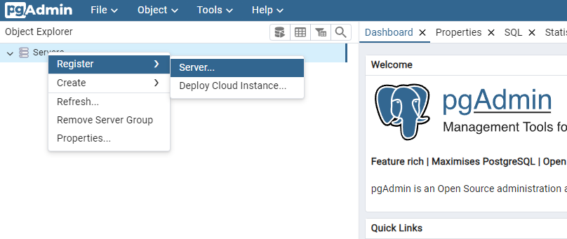

   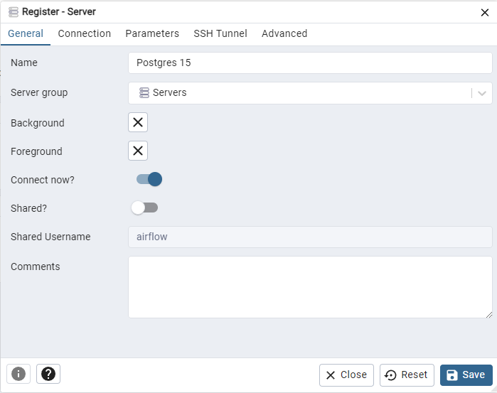

   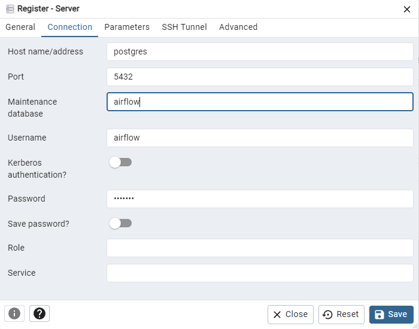
   
3. Check data table movies and ratings (Before data is added):

   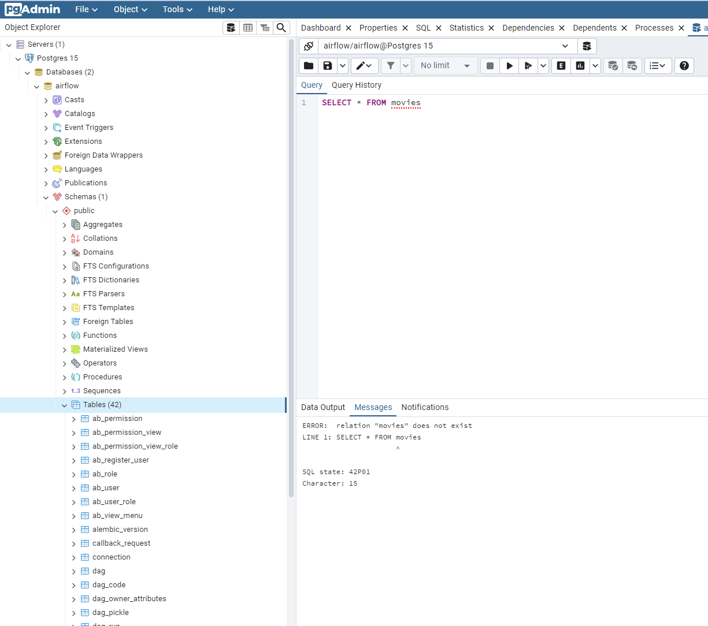

## How to run a DAG to test

1. Accessing airflow web UI [http://localhost:8080](http://localhost:8080) and log in with the following account:
    * Username: admin
    * Password: abc123456
     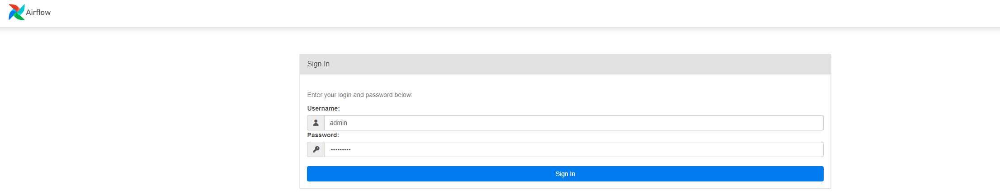
    
2. Connect with the ID 'my_spark_connection' configured in the 'Connections' tab on the menu bar "Admin":

   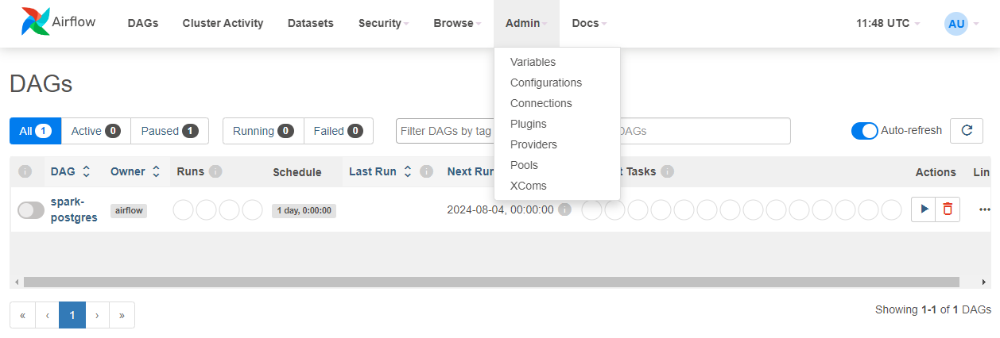

   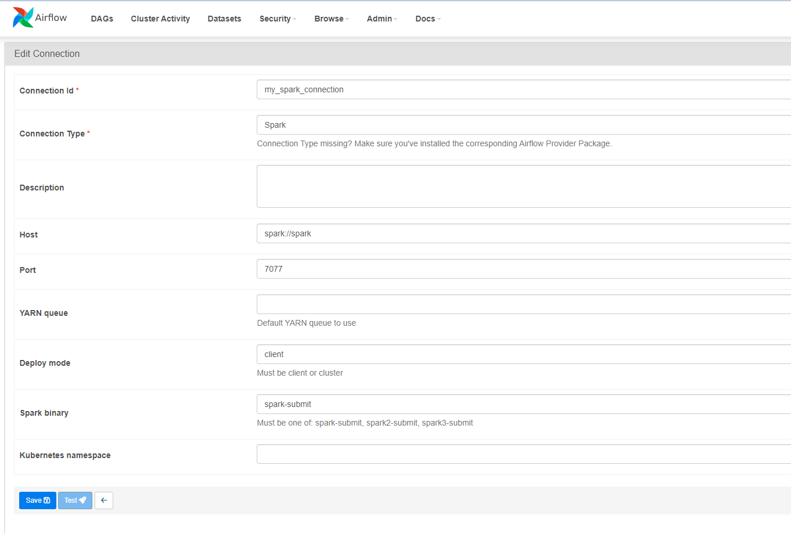

3. Run the spark-postgres DAG

   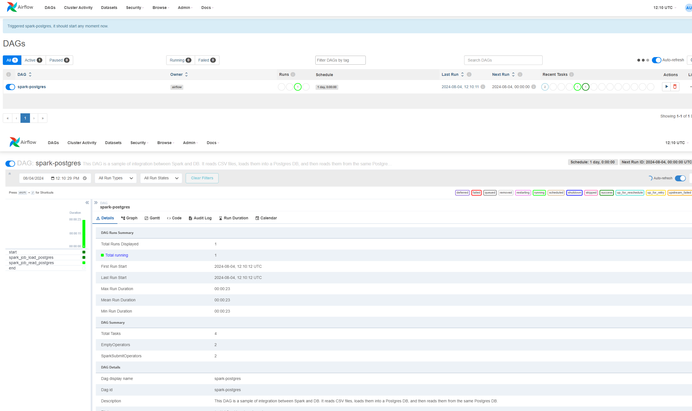

4. Check the DAG log for the task spark_job. You will see the result printed in the log

   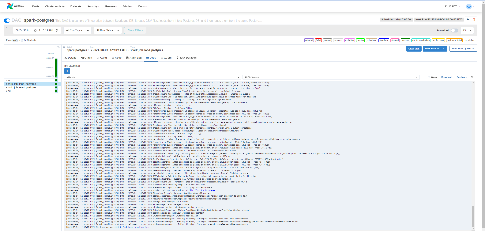

5. Check the spark application in the Spark Master web UI ([http://localhost:8080](http://localhost:8080))

   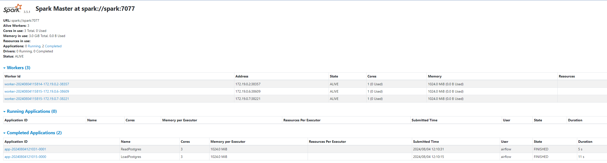
   
6. Check data table movies and ratings (After data has been added):

   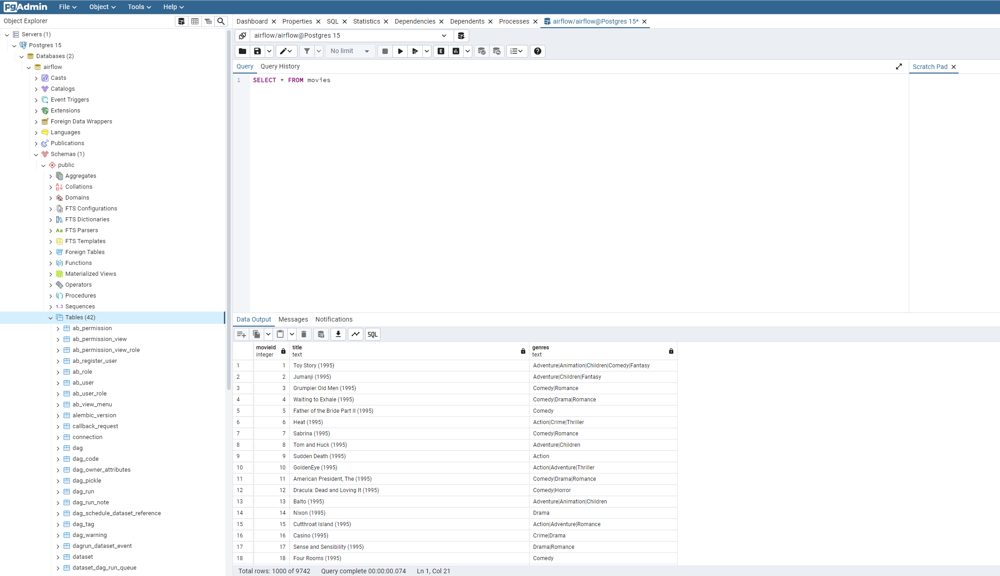

## How to run the Spark Apps via spark-submit
After started your docker containers, run the command below in your terminal:
```
$ docker exec -it docker-airflow spark-submit --master spark://spark:7077 <spark_app_path> [optional]<list_of_app_args>
```

Example running the hellop-world.py application:
```
$ docker exec -it docker-airflow spark-submit --master spark://spark:7077 /opt/spark/app/hello-world.py /opt/spark/resources/data/airflow.cfg
```

## Increasing the number of Spark Workers

You can increase the number of Spark workers just adding new services based on `bitnami/spark:3.5.1` image to the `docker-compose.yml` file like following:

```
spark-worker-n:
        image: bitnami/spark:3.5.1
        user: root
        networks:
            - default_net
        environment:
            - SPARK_MODE=worker
            - SPARK_MASTER_URL=spark://spark:7077
            - SPARK_WORKER_MEMORY=1G
            - SPARK_WORKER_CORES=1
            - SPARK_RPC_AUTHENTICATION_ENABLED=no
            - SPARK_RPC_ENCRYPTION_ENABLED=no
            - SPARK_LOCAL_STORAGE_ENCRYPTION_ENABLED=no
            - SPARK_SSL_ENABLED=no
        volumes:
            - ../spark/app:/usr/local/spark/app # Spark scripts folder (Must be the same path in airflow and Spark Cluster)
            - ../spark/resources/data:/usr/local/spark/resources/data #Data folder (Must be the same path in airflow and Spark Cluster)

```

## Adding Airflow Extra packages

Rebuild Dockerfile (in this example, adding GCP extra):

    $ docker build --rm --build-arg AIRFLOW_DEPS="gcp" -t docker-airflow-spark:2.9.3_3.5.1 .

After successfully built, run docker-compose to start container:

    $ docker-compose up

More info at: https://github.com/puckel/docker-airflow#build

## Useful docker commands

    List Images:
    $ docker images <repository_name>

    List Containers:
    $ docker container ls

    Check container logs:
    $ docker logs -f <container_name>

    To build a Dockerfile after changing sth (run inside directoty containing Dockerfile):
    $ docker build --rm -t <tag_name> .

    Access container bash:
    $ docker exec -i -t <container_name> /bin/bash

## Useful docker-compose commands

    Start Containers:
    $ docker-compose -f <compose-file.yml> up -d

    Stop Containers:
    $ docker-compose -f <compose-file.yml> down --remove-orphans
    
# Extras
## Spark + Postgres sample

* The DAG [spark-postgres.py](dags/spark-postgres.py) loads [movies.csv](spark/resources/data/movies.csv) and [ratings.csv](spark/resources/data/ratings.csv) data into Postgres tables and query these tables to generate a list of top 10 movies with more rates.
  * This DAG runs the load-postgres.py and read-postgres.py applications. These applications are also available in the notebooks [load-postgres-notebook.ipynb](notebooks/load-postgres-notebook.ipynb) and [read-postgres-notebook.ipynb](notebooks/read-postgres-notebook.ipynb).
